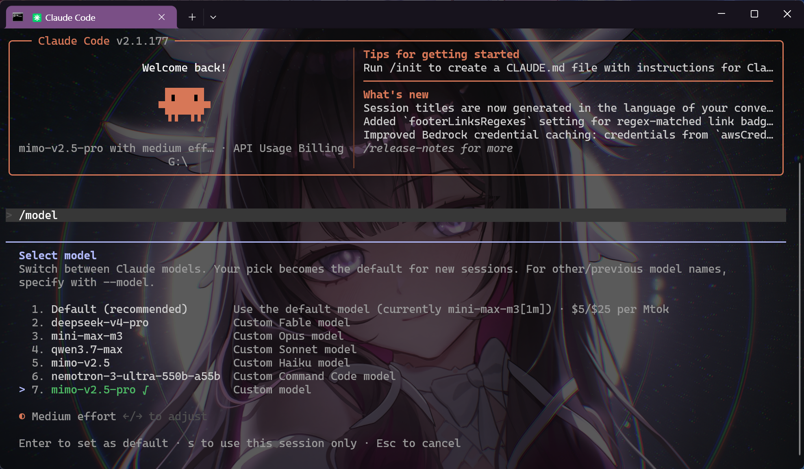

# command-cc

[](https://nodejs.org/)
[](#how-it-works)
[](https://commandcode.ai/)
[](#development)

Run your own Claude Code installation from any folder while routing model calls through your logged-in Command Code account.



## Important Scope

`command-cc` does not bundle, redistribute, include, fork, patch, or modify Claude Code. It is only a local wrapper and gateway that launches the Claude Code CLI already installed on your machine.

The wrapper exists to let a logged-in Command Code Go plan use Command Code models from inside Claude Code. It is not an official Anthropic, Claude Code, or Command Code distribution, and it is not affiliated with or endorsed by those services.

```text
Claude Code
    -> local Anthropic-compatible gateway
        -> Command Code model discovery
        -> Command Code app generation API
```

`command-cc` is a global CLI wrapper. Install it once, then run it inside any repository just like `claude`.

## Quick Start

```powershell
npm install -g .
command-cc login
command-cc doctor
command-cc
```

The default model is `deepseek-v4-flash`. The default picker is capped by Claude Code's current UI shape: one built-in `Default` row, five custom slots, and the checked current model. `command-cc` keeps `deepseek-v4-pro`, `mimo-v2.5`, and `mimo-v2.5-pro` in the visible slots; `qwen3.7-max` remains allowed and can be launched directly with `--model qwen3.7-max`.

Claude Code owns the text on its built-in `Default (recommended)` row. `command-cc` sets the real active model through `ANTHROPIC_MODEL` and the checked picker row; forcing Claude Code's internal default label currently collapses the custom picker rows, so this wrapper keeps the multi-model picker working instead.

Inside Claude Code:

```text
/model
```

For Claude Code Desktop / GUI local sessions:

```powershell
command-cc gui
```

Keep that terminal open, then open Claude Desktop / Claude Code GUI, choose a Local environment, and start a session.

For DeepClaude-style browser Remote Control:

```powershell
command-cc remote
```

For a one-shot prompt:

```powershell
command-cc --model xiaomi/mimo-v2.5-pro -- -p "explain this repo"
```

## What You Get

| Feature | What it does |
| --- | --- |
| Global launcher | Run `command-cc` from any project, using your existing Claude Code install. |
| GUI bridge | Configure Claude Code Desktop / GUI local sessions and run a fixed-port local gateway. |
| Remote Control bridge | Start `claude remote-control` with model requests routed through Command Code. |
| Command Code login reuse | Reads the official Command Code login from `~/.commandcode/auth.json`. |
| Local gateway | Presents an Anthropic-compatible API to Claude Code on `127.0.0.1`. |
| Go-plan filtering | Shows the Go-friendly Command Code models when the logged-in account is on Go. |
| Model aliases | Maps clean ids like `mimo-v2.5-pro` back to real ids like `xiaomi/mimo-v2.5-pro`. |
| Usage checks | `command-cc usage` prints credits, token usage, request counts, and per-model usage. |
| Dry-run mode | `--dry-run` shows the exact Claude Code command/env without spending generation tokens. |
| Stale model cleanup | Removes old wrapper model defaults like `claude-mimo-v2.5-pro` from Claude Code settings before launch. |

## Commands

| Command | Purpose |
| --- | --- |
| `command-cc` | Launch Claude Code through the local Command Code gateway. |
| `command-cc login` | Run the official Command Code CLI login and reuse that auth. |
| `command-cc status` | Delegate to the Command Code CLI status command. |
| `command-cc whoami` | Delegate to the Command Code CLI identity command. |
| `command-cc logout` | Delegate to the Command Code CLI logout command. |
| `command-cc models` | List available Command Code models and gateway picker ids. |
| `command-cc models --json` | Print the model list as JSON for scripts/debugging. |
| `command-cc usage` | Show Command Code credits and usage. |
| `command-cc usage --json` | Print raw usage/account/credit payloads as JSON. |
| `command-cc gui` | Configure GUI local-session env and start the foreground gateway. |
| `command-cc gui setup` | Write GUI local-session env into `~/.claude/settings.json` without starting the gateway. |
| `command-cc gui serve` | Start only the fixed-port GUI gateway. |
| `command-cc gui status` | Show the GUI env config and gateway health. |
| `command-cc gui uninstall` | Remove command-cc managed env keys from Claude Code settings. |
| `command-cc remote` | Start DeepClaude-style browser Remote Control through a local Command Code gateway. |
| `command-cc --remote` | Same as `command-cc remote`. |
| `command-cc doctor` | Check Claude Code, auth, plan detection, model discovery, and selected model. |
| `command-cc env` | Print Anthropic env vars for manual gateway wiring. |
| `command-cc serve` | Start only the local gateway. |
| `command-cc config get` | Show saved wrapper config. |
| `command-cc config path` | Print the config path. |

Installed aliases:

```powershell
command-cc
command-claudecode
claude-command-code
cmdclaude
ccclaude
```

## Installation

Install from GitHub:

```powershell
npm install -g github:sioaeko/command-cc
```

Local development install:

```powershell
npm install -g .
```

Symlink while iterating:

```powershell
npm link
```

Install Command Code itself if login delegation cannot find it:

```powershell
npm i -g command-code@latest
```

## Authentication

The recommended flow is:

```powershell
command-cc login
```

That delegates to the official Command Code CLI (`cmdc login` on Windows, or `cmd login` where available). The wrapper then reads:

```text
~/.commandcode/auth.json
```

You usually do not need to paste an API key into this wrapper.

Auth/config priority:

| Source | Priority |
| --- | --- |
| `--api-key` | Highest |
| `$COMMAND_CODE_API_KEY` or custom `--api-key-env` | High |
| `$CMD_API_KEY` | High |
| Command Code login file | Recommended default |
| Wrapper config API key | Fallback |

Optional wrapper config lives at:

```text
~/.command-claudecode/config.json
```

## Configuration

Save a default model:

```powershell
command-cc config set model "xiaomi/mimo-v2.5-pro"
```

Persist picker behavior:

```powershell
command-cc config set clean-model-name false
command-cc config set filter-models-by-plan true
command-cc config set restrict-model-picker true
```

Show or clear config:

```powershell
command-cc config get
command-cc config unset model
```

Environment variables still override saved preferences:

```powershell
$env:COMMAND_CODE_MODEL = "xiaomi/mimo-v2.5-pro"
$env:COMMAND_CODE_API_KEY = "<command-code-api-key>"
```

## Model Picker Modes

Claude Code 2.1.x renders one built-in `Default` row plus five custom model slots, then adds the checked current model if it is not already in those slots. The built-in `Default` row mirrors Claude Code's Opus/default slot instead of adding a separate seventh Command Code model, so only six distinct Command Code models can be visible at once. The full Go-plan list is still allowed through gateway discovery and direct `--model` selection.

| Mode | Command | `/model` behavior | Best for |
| --- | --- | --- | --- |
| Default | `command-cc` | Starts on `deepseek-v4-flash`. In current Claude Code builds the visible rows are typically `Default`/`deepseek-v4-pro`, then `glm-5.2`, `deepseek-v4-pro`, `mini-max-m3`, `mimo-v2.5`, `mimo-v2.5-pro`, and the checked `deepseek-v4-flash` row. `qwen3.7-max` is still allowed; launch it with `command-cc --model qwen3.7-max`. | Switching among the main Go-plan models inside Claude Code. |
| Clean single-model | `command-cc --clean-model-name` | Uses prefix-free env ids like `mimo-v2.5-pro`; Claude Code may only show the selected model. | Deepclaude-style clean display for one model. |
| Full catalog | `command-cc --all-models` | Disables plan-aware filtering. | Checking everything Command Code exposes. |
| Built-in models allowed | `command-cc --allow-claude-model-list` | Does not restrict Claude Code's own picker list. | Debugging or comparing with native Claude models. |

Default Go-plan picker aliases currently look like:

| Real Command Code id | Claude Code visible alias |
| --- | --- |
| `zai-org/GLM-5.2` | `glm-5.2` |
| `deepseek/deepseek-v4-pro` | `deepseek-v4-pro` |
| `deepseek/deepseek-v4-flash` | `deepseek-v4-flash` |
| `nvidia/nemotron-3-ultra-550b-a55b` | `nemotron-3-ultra-550b-a55b` |
| `Qwen/Qwen3.7-Max` | `qwen3.7-max` |
| `MiniMaxAI/MiniMax-M3` | `mini-max-m3` |
| `xiaomi/mimo-v2.5-pro` | `mimo-v2.5-pro` |
| `xiaomi/mimo-v2.5` | `mimo-v2.5` |

When Claude Code sends `mimo-v2.5-pro`, the gateway forwards `xiaomi/mimo-v2.5-pro` to Command Code.

### Qwen 3.7 Max

`qwen3.7-max` is part of the Go-plan allowlist and remains usable through `command-cc`, but it may not appear in the default `/model` screen on Claude Code 2.1.x. Claude Code currently shows one built-in `Default` row, five custom slots, and the checked current model; because the visible slots prioritize `deepseek-v4-pro`, `mini-max-m3`, `mimo-v2.5`, and `mimo-v2.5-pro`, Qwen can be hidden from the picker even though the gateway still accepts it.

Run Qwen directly:

```powershell
command-cc --model qwen3.7-max
```

Save Qwen as your wrapper default:

```powershell
command-cc config set model qwen3.7-max
command-cc
```

Check that it resolves without spending tokens:

```powershell
command-cc --dry-run --model qwen3.7-max
```

`nvidia/nemotron-3-ultra-550b-a55b` is still recognized, but it is not in the default seven-item picker. Use `--model nemotron-3-ultra-550b-a55b` or `--all-models` if you want it.

## Claude Code Desktop / GUI

Claude Code Desktop local sessions do not always inherit the same shell env as your terminal. `command-cc gui` writes the required Claude env keys into your user `~/.claude/settings.json` under `env`, then starts a fixed-port local gateway:

```powershell
command-cc gui
```

Leave the command running while you use the GUI. In Claude Desktop / Claude Code GUI, choose the Local environment. Cloud and remote sessions cannot reach a local `127.0.0.1` gateway on your machine.

Important GUI limitation: Claude Desktop itself still requires Claude/Anthropic OAuth login and Claude Code entitlement before you can enter the Code tab. Free Claude plans are blocked before any Local Code session starts, so `command-cc` cannot bypass that screen. The wrapper only routes the Local session's model requests through the Command Code gateway after the GUI has already allowed the Code session to start.

Useful GUI commands:

```powershell
command-cc gui setup
command-cc gui serve
command-cc gui status
command-cc gui uninstall
command-cc gui --dry-run
```

### ConnectionRefused

If Claude Code prints `Unable to connect to API (ConnectionRefused)`, it is trying to call a local gateway port where no `command-cc` server is listening.

For CLI use, start Claude through the wrapper:

```powershell
command-cc
```

Do not start plain `claude` after running `command-cc gui setup`; the GUI setup stores `ANTHROPIC_BASE_URL=http://127.0.0.1:64726` in `~/.claude/settings.json`, and plain `claude` will try that port even if the gateway is not running.

For GUI use, keep the gateway process open:

```powershell
command-cc gui
```

Or split setup and serving:

```powershell
command-cc gui setup
command-cc gui serve
```

Check the gateway:

```powershell
command-cc gui status
```

Starting with `command-cc` 0.8.9, CLI launches also pass the current gateway port through `--settings.env`, so stale GUI settings cannot override the wrapper's live random port.

Default GUI gateway:

```text
http://127.0.0.1:64726
```

You can choose another fixed port:

```powershell
command-cc gui --port 48146
```

The GUI setup edits only the `env` keys managed by this wrapper and backs up the previous settings file in:

```text
~/.claude/backups/
```

## Remote Control

`command-cc remote` starts a DeepClaude-style Remote Control session:

```powershell
command-cc remote
```

What happens:

```text
claude remote-control
  -> Anthropic OAuth / Remote Control bridge stays with Claude
  -> model requests go to command-cc local gateway
  -> command-cc forwards generation to Command Code
```

This is not the Claude Desktop Code tab. It is Claude Code Remote Control, which opens a `claude.ai/code/session_...` browser URL while the local `claude` process keeps running.

Remote mode intentionally does not set `ANTHROPIC_AUTH_TOKEN` or `ANTHROPIC_API_KEY` for Claude Code. Those can break the Remote Control OAuth bridge. The Command Code key stays inside the local gateway process.

Pass Remote Control arguments after `--`:

```powershell
command-cc remote -- --name "Command Code session"
command-cc --remote -- --name "Command Code session"
```

Dry-run without starting Claude Code:

```powershell
command-cc remote --dry-run
```

Remote Control still requires Claude/Anthropic login and Remote Control eligibility. If Claude blocks your account before the local session starts, this wrapper cannot bypass that entitlement check.

## Go Plan Behavior

By default, the picker is filtered to seven priority Go-friendly models known to this wrapper. The wrapper keeps this filter even when Command Code account/plan endpoints are unavailable, because model discovery can still work while plan metadata is temporarily missing:

```text
deepseek/deepseek-v4-pro
deepseek/deepseek-v4-flash
zai-org/GLM-5.2
Qwen/Qwen3.7-Max
MiniMaxAI/MiniMax-M3
xiaomi/mimo-v2.5-pro
xiaomi/mimo-v2.5
```

Check what the wrapper sees:

```powershell
command-cc models
command-cc models --json
```

Bypass the filter:

```powershell
command-cc --all-models
command-cc models --all-models
```

Force it back on, even if config disables it:

```powershell
command-cc --plan-filter
```

## Usage And Credits

Check credits without starting Claude Code:

```powershell
command-cc usage
```

Example shape:

```text
Command Code usage
account: your-name
plan: individual-go (active)
period: 2026-06-15 -> 2026-07-15
credits: monthly 9.8689, purchased 0, free 0
usage: 0.1311 credits, 299,547 tokens, 27 requests
models:
  xiaomi/mimo-v2.5-pro    27 req    0.1311 credits
```

Use JSON for scripts:

```powershell
command-cc usage --json
```

## Dry Runs

`--dry-run` spends no generation tokens. When logged in, it performs model discovery so the shown env slots and `availableModels` match a real launch.

```powershell
command-cc --dry-run --model xiaomi/mimo-v2.5-pro
command-cc --dry-run --model mimo-v2.5-pro
command-cc --dry-run --clean-model-name
```

Use this when `/model` looks wrong before burning credits on an actual prompt.

## How It Works

```text
Claude Code
  reads ANTHROPIC_BASE_URL=http://127.0.0.1:<port>
  sends /v1/models and /v1/messages

command-cc local gateway
  answers /v1/models with Claude Code-compatible aliases
  converts Anthropic Messages requests into Command Code app API requests
  converts Command Code streaming output back into Anthropic-style events

Command Code
  /provider/v1/models       model discovery only
  /alpha/generate           actual generation
  /alpha/billing/*          usage and subscription checks
```

The real Command Code API key stays in the local gateway process. Claude Code receives a local placeholder auth token, not your Command Code key.

## Troubleshooting

| Symptom | What to run | Likely fix |
| --- | --- | --- |
| `/model` only shows MiMo, or shows MiMo five times | `command-cc --dry-run` | Restart old Claude Code sessions. New launches should place Go-plan models into clean picker slots. |
| MiniMax, GLM, or another Go model disappears | `command-cc --dry-run` then restart | Make sure the wrapper is current. `Default` carries the selected model, five custom slots carry priority models, and extra models are exposed through gateway discovery / `availableModels`. |
| Only two models show after adding `mimo-v2.5` | `command-cc --dry-run` then restart | Make sure the wrapper is `0.6.17` or newer. Stale gateway model cache is cleared before launch. |
| A duplicate selected model appears as row 7 | `command-cc --dry-run` then restart | Make sure the wrapper is `0.6.17` or newer. It removes stale `~/.claude/settings.json` model values before launch. |
| `claude-*` names show up in the first Go models | `command-cc --dry-run` then restart | Restart old sessions and make sure the wrapper is `0.6.17` or newer. |
| `401 Invalid Authorization` | `command-cc login` then `command-cc doctor` | Refresh the official Command Code login. |
| `402 upgrade_required` from Provider API | `command-cc doctor` | Generation should use `/alpha/generate`; Provider API is only for model discovery. |
| `MODEL_NOT_IN_PLAN` or plan access error | `command-cc models` | Pick one of the listed models or use `--all-models` to inspect the full catalog. |
| `spawn EINVAL` | `command-cc -- --version` | Verify Claude Code can spawn through the wrapper. Update/restart old sessions. |
| Command Code CLI not found | `npm i -g command-code@latest` | The wrapper falls back to `npx`, but global install is cleaner. |
| Wrong auth/account | `command-cc whoami` | Check the official Command Code account currently logged in. |
| GUI asks you to log in before showing Code | Sign in to Claude Desktop | This is the GUI app's own Claude/Anthropic OAuth login. `command-cc` cannot bypass it. |
| GUI says your account is on the Free plan | Use terminal `command-cc`, or use a Claude account with Code access | Claude Code Desktop blocks Free-plan accounts before gateway routing can start. |
| GUI session ignores the gateway | `command-cc gui status` | Use a Local session, restart the GUI after setup, and keep `command-cc gui` or `command-cc gui serve` running. |
| Remote Control fails before showing a URL | `claude doctor`, then `command-cc remote --dry-run` | Remote Control eligibility/OAuth is checked by Anthropic before model routing starts. |

## Development

Useful checks:

```powershell
node --check .\bin\command-claudecode.mjs
command-cc --version
command-cc doctor
command-cc models
command-cc models --json
command-cc gui --dry-run
command-cc gui status
command-cc remote --dry-run
command-cc -- --version
npm pack --dry-run
```

Start only the local gateway:

```powershell
command-cc serve --port 48146
```

Inspect models from that gateway:

```powershell
Invoke-RestMethod http://127.0.0.1:48146/v1/models
```

## Notes

- Node.js 20 or newer is required.
- The wrapper is intentionally local-first: no background daemon is installed.
- Claude Code is required separately. This package does not ship Claude Code or any modified Claude Code files.
- Image inputs are currently represented as text placeholders when adapting to Command Code's app API.
- The package is distributed without an open-source license unless a license file is added later.
- The repository is packaged with only `bin/`, `assets/`, `README.md`, and `package.json`.
